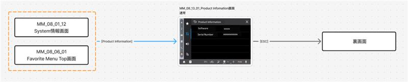

| 1**文書ID**    | 05_01_08_Version Information |
|----------------|------------------------------|
| **状態**       | 作成中                       |
| **秘匿レベル** | Confidential                 |

| 5**プロジェクト名** | JD847 |
|---------------------|-------|

&JD847_システム要件定義書(05_01_08_Version Information)

15**ドキュメントのプロパティ**

| 作成者 | 作成日 | 照査 | 照査日 | 承認 | 承認日 |
|--------|--------|------|--------|------|--------|
|        |        |      |        |      |        |

# Contents

[1 概要 [4](#概要)](#概要)

[1.1 目的 [4](#目的)](#目的)

[2 用語・略語の定義 [4](#用語略語の定義)](#用語略語の定義)

[2.1 用語 [4](#用語)](#用語)

[2.2 略語 [5](#略語)](#略語)

[3 入力情報 [5](#入力情報)](#入力情報)

[3.1 入力ドキュメント [5](#入力ドキュメント)](#入力ドキュメント)

[3.2 関連ドキュメント [6](#関連ドキュメント)](#関連ドキュメント)

[4 機能概要 [7](#機能概要)](#機能概要)

[4.1 関連法規・規格 [7](#関連法規規格)](#関連法規規格)

[5 機能要件 [7](#機能要件)](#機能要件)

[5.1 製品情報 [7](#製品情報)](#製品情報)

[5.2 HMI要件 [8](#hmi要件)](#hmi要件)

[5.2.1 Version情報画面におけるUI仕様制約
[8](#version情報画面におけるui仕様制約)](#version情報画面におけるui仕様制約)

[5.3 画面遷移 [10](#画面遷移)](#画面遷移)

[6 更新履歴 [11](#更新履歴)](#更新履歴)

# 概要

本書はダイハツ28DA(Display
Audio)製品（&JD847）のVersion情報に関するシステム要求を 規定する。

## 目的

車両利用者にVersion情報を提供すること

# 用語・略語の定義

## 用語

| **用語** | **説明** |
|----|----|
| SW | ソフトウェア。1つ以上のコンピュータ(マイコン含む)と周辺機器を動作させるためのプログラムや命令と処理するデータ。論理的な機能のコンポーネント。 |
| HW | ハードウェア。電気電子デバイスまたは電気電子デバイスで構成される要素と機械要素で、システムエンジニアリング領域で扱われるハードウェアに関する要素。 |
|  | ※システムエンジニアリングから展開される、電気電子、機械に関連する開発は、Automotive SPICE3.1では含まない。 |
| システム要求 | 製品要求またはソフトウェアとハードウェアの両方で実現する要求。 |
|   |   |
|   |   |
|   |   |

## 略語

| **略語** | **フルスペル**        |
|----------|-----------------------|
| ECU      | Electric Control Unit |
| HW       | Hardware              |
| ID       | Identifier            |
| PM       | Project Manager       |
| SW       | Software              |
| SYS      | System                |

# 入力情報

## 入力ドキュメント

| **文書コード** | **文書名** | **版番号** |
|----------------|------------|------------|
|               |           |           |
|               |           |           |
|               |           |           |
|               |           |           |
|               |           |           |x`

## 関連ドキュメント

| **文書コード** | **文書名**           | **版番号** |
|----------------|----------------------|------------|
|               | システム要求定義基準 |           |
|               |                     |           |
|               |                     |           |
|               |                     |           |
|               |                     |           |

# 機能概要

車両利用者が製品のVersion情報を見れるようにする

## 関連法規・規格

# 機能要件

【システム要件を、システム要件ワークアイテムを使用して記載する。要件の機能は「説明」欄に記載する。】

## 製品情報

上位要件：  
製品情報がユーザーに表示され確認できること  
理由：  
ユーザーが製品識別やバージョン確認を行うために必要である  
下位要件：

JD847/JD847-7099■ DAのパッケージバージョンが表示される

| 車両：D91N(Thai)   | ○     |
|--------------------|-------|
| 車両：D91N(ES LHD) | ○     |
| 車両：D91N(ES RHD) | ○     |
| リリース           | PreCV |

JD847/JD847-7100■ シリアル番号が表示される

| 車両：D91N(Thai)   | ○     |
|--------------------|-------|
| 車両：D91N(ES LHD) | ○     |
| 車両：D91N(ES RHD) | ○     |
| リリース           | PreCV |

## HMI要件

### Version情報画面におけるUI仕様制約

UI構成及び表示仕様を制約条件として定義するものであり、動作分岐や状態遷移を定義するものではない。

| **Parts No.** | **Parts分類** | **説明**                  |
|---------------|---------------|---------------------------|
| P1            | 操作          | タブ(SystemSetting参照)   |
| P2            | 表示のみ      | Software                  |
| P3            | 表示のみ      | Serial Number             |
| P4            | 表示のみ      | Software Version          |
| P5            | 表示のみ      | Serial Number String      |
| P6            | 操作          | Dock bar(HMI共通処理参照) |
| P7            | 操作          | Side bar(HMI共通処理参照) |
| 1-A           | 操作          | Back(HMI共通処理参照)     |
| 2-A           | 操作          | ESCAPE(HMI共通処理参照)   |

#### Back操作時の遷移先分岐制御

上位要件：  
Product
Infomation画面では、Back操作時に遷移元に応じて遷移先を切り替える。  
理由：  
同一操作で遷移先が分岐するため、遷移元を保持した状態管理が必要である。  
下位要件：  

JD847/JD847-7105■ Favorite Menu
Topから遷移した場合、Back操作時にFavorite Menu Top画面へ遷移する

| 車両：D91N(Thai)   | ○     |
|--------------------|-------|
| 車両：D91N(ES LHD) | ○     |
| 車両：D91N(ES RHD) | ○     |
| リリース           | PreCV |

JD847/JD847-7106■ Favorite Menu
Top以外から遷移した場合、Back操作時にSystem情報画面へ遷移する

| 車両：D91N(Thai)   | ○     |
|--------------------|-------|
| 車両：D91N(ES LHD) | ○     |
| 車両：D91N(ES RHD) | ○     |
| リリース           | PreCV |

## 画面遷移

[<u>Figma</u>](https://www.figma.com/board/tzL5182uVxGOcu5Fv6djAx/MM_08_13_VersionInformation?t=BoNtGJAIfesW5Fo6-6)

[<u>操作仕様書</u>](http://cnavisvn.kwg.pioneer.co.jp/intra/svn/Navi_OSIRIS_Spec/28Model/JD847_Spec/ope/ope08/MM_08_13_VersionInformation.xlsx)

# 更新履歴

54**更新履歴:**

| バージョン | 説明 | ドキュメントリンク | 更新者 | リビジョン |
|------------|------|--------------------|--------|------------|

※ ドキュメントベースラインより、改訂履歴を自動生成します。

※ ドキュメントのステータスを変更した際に、ドキュメントベースラインを自動設定します。

※ ドキュメントプロパティより、「バージョン」、「説明」を記載してください。

※ リビジョンは、Polarion内部のSubversionのリビジョンです。

※ 更新日は、説明欄に表示されます。

 